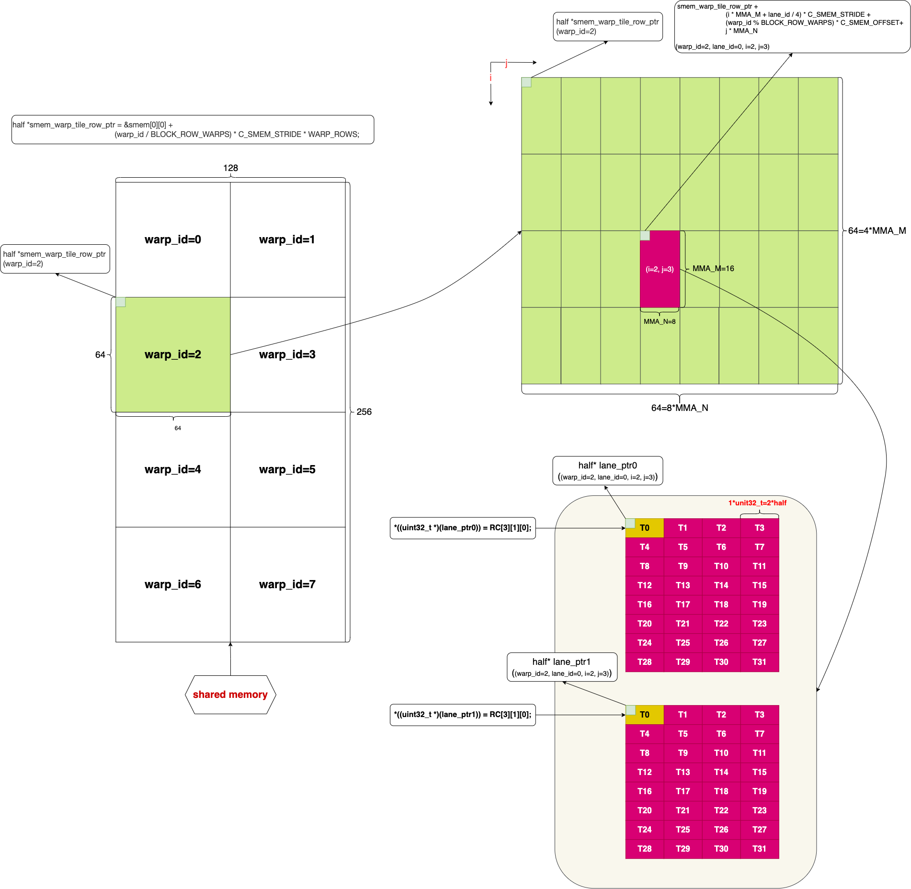

## mma_base


### 1. Block Level Layout

```c++
#define BLOCK_ROWS 256
#define BLOCK_COLS 128
#define BLOCK_STRIDE 16

200 void mmaBase(half *A, half *B, half *C, size_t M, size_t N, size_t K) {
201     static size_t smem_max_size = initMmaBase();
202
203     dim3 block(THREADS_PER_BLOCK);
204     dim3 grid(BLOCK_STRIDE, div_ceil(M, BLOCK_ROWS), div_ceil(N, BLOCK_COLS * BLOCK_STRIDE));
205
206     mmaBaseKernel<<<grid, block, smem_max_size>>>(A, B, C, M, N, K);
207 }

// in kernel function: mmaBaseKernel
 45 __global__ void mmaBaseKernel(const half *__restrict__ A, const half *__restrict__ B, half *__restrict__ C, size_t M,
 46                               size_t N, size_t K) {
 47     const size_t M_tiles = div_ceil(M, MMA_M);
 48     const size_t N_tiles = div_ceil(N, MMA_N);
 49     const size_t K_tiles = div_ceil(K, MMA_K);
 50
 51     const size_t block_tile_i =
 52         (blockIdx.z % 2) ? ((gridDim.y - blockIdx.y - 1) * BLOCK_COL_TILES) : (blockIdx.y * BLOCK_COL_TILES);
 53     const size_t block_tile_j = (blockIdx.z * gridDim.x + blockIdx.x) * BLOCK_ROW_TILES;
 54
 55     if (block_tile_i >= M_tiles || block_tile_j >= N_tiles) {
 56         return;
 57     }
```

* Figure-1是 C 矩阵在 block 层级的布局


<center> Figure-1 <center>

* C 矩阵中 block 的排列方式在图中用 (i, j) 标识
  * i,j 的计算和 block_tile_i 与 block_tile_j 基本一样，只是没有乘以BLOCK_COL_TILES和BLOCK_ROW_TILES

* 这里的 (i, j) 表示的顺序就是 **swizzle** (这里 swizzle stride 是 16)

* 关于 swizzle 还有些隐藏的知识点和问题

  * 每个 block 是 gpu scheduler 根据策略（看哪个 SM 上有空闲资源）**动态分配**给某个 SM 的，也就是说某个 block 可以分配给任意的 SM 

  * blockIdx.x, blockIdx.y 和 blockIdx.z 被分配的顺序是先 x 再 y 最后是 z，类似于下面的 for 循环

    ```c++
    printf("order of blocks: ");
    for(int z=0; z<gridDim.z; ++z)
      for(int y=0; y<gridDim.y; ++y)
        for(int x=0; x<gridDim.x; ++x)
          printf("(%d, %d, %d)",x,y,z);
    ```

  * Figure-1中 block 的顺序:  首先 z=0, (x,y) 对应到图中的 (i,j)，然后 z 每次累加，即可得到图中 block 的分配顺序

* 之所以要使用 swizzle 是为了提高L2 Cache命中率以下是[知乎作者木子知关于swizzle的具体描述](https://zhuanlan.zhihu.com/p/639297098)：

  


### 2. load from Global Memory to Shared Memory

```c++
 83     const half *A_warp_ptr = &A[block_tile_i * MMA_M * K] + BLOCK_ROWS / WARPS_PER_BLOCK * K * warp_id;
 84     const half *B_warp_ptr = &B[block_tile_j * MMA_N * K] + BLOCK_COLS / WARPS_PER_BLOCK * K * warp_id;
 85
 86     constexpr size_t A_smem_iters = BLOCK_ROWS / (CHUNK_COPY_LINES_PER_WARP * WARPS_PER_BLOCK);
 87     constexpr size_t B_smem_iters = BLOCK_COLS / (CHUNK_COPY_LINES_PER_WARP * WARPS_PER_BLOCK);
 88
 89 #pragma unroll
 90     for (size_t tile_k = 0; tile_k < K_tiles; tile_k += CHUNK_K) {
 91         size_t A_smem_idx = BLOCK_ROWS / WARPS_PER_BLOCK * warp_id;
 92         int4 *A_lane_ptr = (int4 *)(A_warp_ptr + tile_k * MMA_K + (lane_id / CHUNK_COPY_LINE_LANES) * K) +
 93                            (lane_id % CHUNK_COPY_LINE_LANES);
 94         A_smem_idx += lane_id / CHUNK_COPY_LINE_LANES;
 95
 96 #pragma unroll
 97         for (size_t i = 0; i < A_smem_iters; ++i) {
 98             *((int4 *)&smem[A_smem_idx][0] + (lane_id % CHUNK_COPY_LINE_LANES)) = *A_lane_ptr;
 99
100             A_lane_ptr = (int4 *)((half *)A_lane_ptr + CHUNK_COPY_LINES_PER_WARP * K);
101             A_smem_idx += CHUNK_COPY_LINES_PER_WARP;
102         }
103
104         size_t B_smem_idx = B_smem_idx_off + BLOCK_COLS / WARPS_PER_BLOCK * warp_id;
105         int4 *B_lane_ptr = (int4 *)(B_warp_ptr + tile_k * MMA_K + (lane_id / CHUNK_COPY_LINE_LANES) * K) +
106                            (lane_id % CHUNK_COPY_LINE_LANES);
107         B_smem_idx += lane_id / CHUNK_COPY_LINE_LANES;
108
109 #pragma unroll
110         for (size_t i = 0; i < B_smem_iters; ++i) {
111             *((int4 *)&smem[B_smem_idx][0] + (lane_id % CHUNK_COPY_LINE_LANES)) = *B_lane_ptr;
112
113             B_lane_ptr = (int4 *)((half *)B_lane_ptr + CHUNK_COPY_LINES_PER_WARP * K);
114             B_smem_idx += CHUNK_COPY_LINES_PER_WARP;
115         }
116
117         __syncthreads();

```

* 每计算 C 矩阵中的一个 block 需要 Figure-1 A 矩阵中黄色区域以及 B 矩阵中的黄色区域

* Figure-2 是 A 矩阵 (row-major) 对应的计算部分从 global mem 搬移到 shared memory 

  

  <center> Figure-2 <center>

  * A 矩阵中的黄色部分由 8 个 warp 负责
  * 每次将 tile_k 和 tile_k+1 两个部分都搬移至 shared memory
  * shared memory 总体上前面部分放矩阵 A，后半部分放矩阵 B


* Figure-3 是 B 矩阵 (col-major) 对应的计算部分从 global mem 搬移到 shared memory 

  

  <center> Figure-3 <center>

  * 与矩阵 A 的搬移过程类似，不同的是 B 矩阵是 col-major，所以到 shared memory 有个 transpose 的过程


### 3. Warp Level Layout

Figure-4  是 每个 block 的 Warp Layout 


<center> Figure-4 <center>

* C 矩阵中的每个 block 尺寸为 256*128，每行有2个 warp，每列有4个 warp


### 4. from Shared Memory to Register and calculation

```c++
119 #pragma unroll
120         for (size_t k_step = 0; k_step < CHUNK_K; ++k_step) {
121             uint32_t RA[WARP_COL_TILES][4]; // RA[4][4]
122             uint32_t RB[WARP_ROW_TILES][2]; // RB[8][2]
123
124 #pragma unroll
125             for (size_t i = 0; i < WARP_COL_TILES; ++i) {
126                 size_t A_smem_idx = (warp_id / BLOCK_ROW_WARPS) * WARP_ROWS + i * MMA_M;
127                 uint32_t A_smem_lane_addr =
128                     __cvta_generic_to_shared(&smem[A_smem_idx + lane_id % 16][k_step * MMA_K + (lane_id / 16) * 8]);
129
130                 LDMATRIX_X4(RA[i][0], RA[i][1], RA[i][2], RA[i][3], A_smem_lane_addr);
131             }
132
133 #pragma unroll
134             for (size_t j = 0; j < WARP_ROW_TILES; ++j) {
135                 size_t B_smem_idx = B_smem_idx_off + (warp_id % BLOCK_ROW_WARPS) * WARP_COLS + j * MMA_N;
136                 uint32_t B_smem_lane_addr =
137                     __cvta_generic_to_shared(&smem[B_smem_idx + lane_id % 8][k_step * MMA_K + ((lane_id / 8) % 2) * 8]);
138
139                 LDMATRIX_X2(RB[j][0], RB[j][1], B_smem_lane_addr);
140             }
141
142 #pragma unroll
143             for (size_t i = 0; i < WARP_COL_TILES; ++i) {
144 #pragma unroll
145                 for (size_t j = 0; j < WARP_ROW_TILES; ++j) {
146                     size_t j_s = (i % 2) ? (WARP_ROW_TILES - j - 1) : j;
147
148                     HMMA16816(RC[i][j_s][0], RC[i][j_s][1], RA[i][0], RA[i][1], RA[i][2], RA[i][3], RB[j_s][0],
149                               RB[j_s][1], RC[i][j_s][0], RC[i][j_s][1]);
150                 }
151             }
152         }
153
154         __syncthreads();
155     }
```

下面的 Figure-5  是每个 Warp 内部 Tile 的计算过程


<center> Figure-5 <center>

* 每个 Warp 尺寸大小为 64x64，每个 Tile 尺寸为16x8 ==> 每个 Warp 有 4x8 个 Tile

* 每个Tile计算需要的 A矩阵数据与 B 矩阵数据都已经在 shared memory 里

* 从 shared memory 获取数据到寄存器用了 ptx 如下

  ```
  #define LDMATRIX_X1(R, addr) \
      asm volatile("ldmatrix.sync.aligned.x1.m8n8.shared.b16 {%0}, [%1];\n" : "=r"(R) : "r"(addr))
  
  #define LDMATRIX_X2(R0, R1, addr) \
      asm volatile("ldmatrix.sync.aligned.x2.m8n8.shared.b16 {%0, %1}, [%2];\n" : "=r"(R0), "=r"(R1) : "r"(addr))
  
  #define LDMATRIX_X4(R0, R1, R2, R3, addr)                                             \
      asm volatile("ldmatrix.sync.aligned.x4.m8n8.shared.b16 {%0, %1, %2, %3}, [%4];\n" \
                   : "=r"(R0), "=r"(R1), "=r"(R2), "=r"(R3)                             \
                   : "r"(addr))
  
  #define HMMA16816(RD0, RD1, RA0, RA1, RA2, RA3, RB0, RB1, RC0, RC1)                                                    \
      asm volatile("mma.sync.aligned.m16n8k16.row.col.f16.f16.f16.f16 {%0, %1}, {%2, %3, %4, %5}, {%6, %7}, {%8, %9};\n" \
                   : "=r"(RD0), "=r"(RD1)                                                                                \
                   : "r"(RA0), "r"(RA1), "r"(RA2), "r"(RA3), "r"(RB0), "r"(RB1), "r"(RC0), "r"(RC1))
  ```

* 需要注意的是 Figure-5 中 shared memory 里 

  * A 矩阵部分（图中四个绿色块块），每个 thread 是直接对准 shared memory 相应的行
  * B 矩阵部分（图中两个蓝色块块），每个 thread 实际上对准的是 shared memory 里的行，图中画出来的对应关系是 transpose 后的结果

* 每个 Warp 计算 Tile 的顺序，如图中红色箭头所示，为了提高 Register 复用率（[知乎作者木子知关于提高寄存器重复利用率的具体描述](https://zhuanlan.zhihu.com/p/639297098)）：

  

* ldmatrix 经常与mma.sync.aligned.m16n8k16（或其他不同尺度 Tile ）配合使用

  * 这样可以保证每个 thread 寄存器 RA/RB/RC 获取的刚好是计算每个Tile 所需的对应元素

  ```
  #define HMMA16816(RD0, RD1, RA0, RA1, RA2, RA3, RB0, RB1, RC0, RC1)                                                    \
      asm volatile("mma.sync.aligned.m16n8k16.row.col.f16.f16.f16.f16 {%0, %1}, {%2, %3, %4, %5}, {%6, %7}, {%8, %9};\n" \
                   : "=r"(RD0), "=r"(RD1)                                                                                \
                   : "r"(RA0), "r"(RA1), "r"(RA2), "r"(RA3), "r"(RB0), "r"(RB1), "r"(RC0), "r"(RC1))
  ```


### 5. from Register to Shared Memory

```c++
157 #pragma unroll
158     for (size_t i = 0; i < WARP_COL_TILES; ++i) {
159 #pragma unroll
160         for (size_t j = 0; j < WARP_ROW_TILES; ++j) {
161             half *lane_ptr0 = smem_warp_tile_row_ptr + (i * MMA_M + lane_id / 4) * C_SMEM_STRIDE +
162                               (warp_id % BLOCK_ROW_WARPS) * C_SMEM_OFFSET + j * MMA_N +
163                               (lane_id % 4) * sizeof(uint32_t) / sizeof(half);
164             half *lane_ptr1 = smem_warp_tile_row_ptr + (i * MMA_M + lane_id / 4 + 8) * C_SMEM_STRIDE +
165                               (warp_id % BLOCK_ROW_WARPS) * C_SMEM_OFFSET + j * MMA_N +
166                               (lane_id % 4) * sizeof(uint32_t) / sizeof(half);
167
168             *((uint32_t *)(lane_ptr0)) = RC[i][j][0];
169             *((uint32_t *)(lane_ptr1)) = RC[i][j][1];
170         }
171     }
172
173     __syncthreads();
```

Figure-6  是将寄存器结果搬移到 shared memory 的过程



<center> Figure-6 <center>

* 这里寄存器 RC 赋值给 shared memory 中对应位置索引

* 要说明的是，这里的 shared memory 的形状和之前 Figure-2 & Figure-3 不同

  * Figure-2 & Figure-3 中 shared memory 是 (256+128)*32

  * 这里的 shared memory 是 256 *128

  * 这两种不同的形状无关紧要，

    * 因为 shared memory 可以认为是 row-major
    * 在存储空间上是一维的，只要一维的存储空间足够，什么形状的都无所谓

  * 在确定 shared memory 大小的相关代码中其实已经判断了是否有足够的空间

    ```c++
    189     size_t smem_max_size =
    190         std::max((BLOCK_ROWS + BLOCK_COLS) * AB_SMEM_STRIDE * sizeof(half), BLOCK_ROWS * C_SMEM_STRIDE * sizeof(half));
    191     HLOG("smem_max_size: %.0f KBytes (%zu Bytes)", static_cast<double>(smem_max_size) / 1024, smem_max_size);
    192
    193     HGEMM_CHECK_GT(dev_prop.sharedMemPerMultiprocessor, smem_max_size);
    194     HGEMM_CHECK_CUDART_ERROR(
    195         cudaFuncSetAttribute(mmaBaseKernel, cudaFuncAttributeMaxDynamicSharedMemorySize, smem_max_size));
    
    ```

    * AB_SMEM_STRIDE 是宏定义，大小是32
    * 实际上，smem_max_size = max(  (256+128)*32, 256 *128  ) \* sizeof(half)

  

### 6. from Shared Memory to Global Memory

```c++
175 #pragma unroll
176     for (size_t i = 0; i < MMA_M; ++i) {
177         *((int4 *)(src_gmem_warp_stream_ptr + (i * 2 + lane_id / 16) * N) + lane_id % 16) =
178             *((int4 *)(smem_warp_stream_ptr + (i * 2 + lane_id / 16) * C_SMEM_STRIDE) + lane_id % 16);
179     }
180 }
```

Figure-7  是将 shared memory 结果搬移到 global memory 的过程


<center> Figure-7 <center>

* 这里的 shared memory 依然是 256 *128
* 最终将 block 对应的 shared memory 的结果放到矩阵 C 中


### 7. Pipeline 

* Figure-8 是一个 warp 内所有 thread 的 pipeline

  


* LDGSTS：load from global memory; store to shared memory

* S2R: from Shared memory to Register
* calc: Tile calculation
* R2S: from Register to Shared memory
* LDS: load from shared memory to global memory

