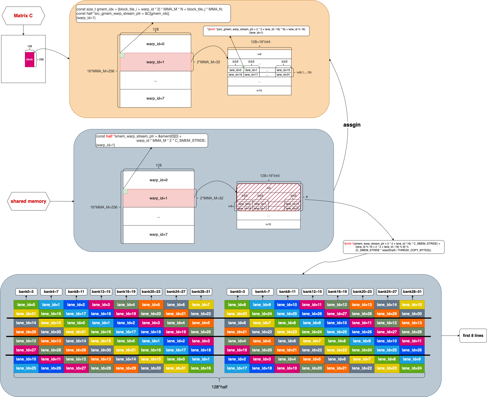

## mma_permuted

与 mma_base.cu 相比，permuted 版本的目的是减少 ldmatrix 中 shared memory 的 bank conflict，也就是说跟 shared memory 相关的部分都做了改动，无关的部分全部一致，所以这里只对不同的部分进行分析，相同的不做冗余说明。


### 1. Block Level Layout

* 与 base 版本一致

  

### 2. load from Global Memory to Shared Memory

```c++
 96 #pragma unroll
 97     for (size_t tile_k = 0; tile_k < K_tiles; tile_k += CHUNK_K) {
 98         size_t A_smem_idx = BLOCK_ROWS / WARPS_PER_BLOCK * warp_id;
 99         int4 *A_lane_ptr = (int4 *)(A_warp_ptr + tile_k * MMA_K + (lane_id / CHUNK_COPY_LINE_LANES) * K) +
100                            (lane_id % CHUNK_COPY_LINE_LANES);
101         A_smem_idx += lane_id / CHUNK_COPY_LINE_LANES;
102
103 #pragma unroll
104         for (size_t i = 0; i < A_smem_iters; ++i) {
105             *((int4 *)&smem[A_smem_idx][0] +
106               ((lane_id % CHUNK_COPY_LINE_LANES) +
107                (A_smem_idx % (CHUNK_COPY_LINE_LANES * SMEM_BANK_ROWS)) / SMEM_BANK_ROWS) %
108                   CHUNK_COPY_LINE_LANES) = *A_lane_ptr;
109
110             A_lane_ptr = (int4 *)((half *)A_lane_ptr + CHUNK_COPY_LINES_PER_WARP * K);
111             A_smem_idx += CHUNK_COPY_LINES_PER_WARP;
112         }
113
114         size_t B_smem_idx = B_smem_idx_off + BLOCK_COLS / WARPS_PER_BLOCK * warp_id;
115         int4 *B_lane_ptr = (int4 *)(B_warp_ptr + tile_k * MMA_K + (lane_id / CHUNK_COPY_LINE_LANES) * K) +
116                            (lane_id % CHUNK_COPY_LINE_LANES);
117         B_smem_idx += lane_id / CHUNK_COPY_LINE_LANES;
118
119 #pragma unroll
120         for (size_t i = 0; i < B_smem_iters; ++i) {
121             *((int4 *)&smem[B_smem_idx][0] +
122               ((lane_id % CHUNK_COPY_LINE_LANES) +
123                (B_smem_idx % (CHUNK_COPY_LINE_LANES * SMEM_BANK_ROWS)) / SMEM_BANK_ROWS) %
124                   CHUNK_COPY_LINE_LANES) = *B_lane_ptr;
125
126             B_lane_ptr = (int4 *)((half *)B_lane_ptr + CHUNK_COPY_LINES_PER_WARP * K);
127             B_smem_idx += CHUNK_COPY_LINES_PER_WARP;
128         }
129
130         __syncthreads();
```

* Figure-1 是 A 矩阵 (row-major) 数据从 global memory 搬运到 shared memory 的过程

  

<center> Figure-1 <center>

* 很显然，与 base 版本相比，不同颜色的数据块被搬运到不同 bank 上，这个过程就是 permute

  * 这里和 base 版本一样，每个 warp 同样会产生 bank conflict
  * 直到 ldmatrix 的时候才会看到减少 bank conflict 的收益

* 对于 shared memory 赋值语句中计算索引的简单说明

  * 赋值语句如下
    *  *((**int4 \***)&smem=\[A_smem_idx][0] + ((lane_id % CHUNK_COPY_LINE_LANES) + (A_smem_idx % (CHUNK_COPY_LINE_LANES * SMEM_BANK_ROWS)) / SMEM_BANK_ROWS) %CHUNK_COPY_LINE_LANES) = *A_lane_ptr;

  * 主要看后面跟列有关的部分（将宏定义数值带入）：

    * ((lane_id % 4) + (A_smem_idx % 8) / 2)%4

      * (lane_id % 4) + (A_smem_idx % 8) / 2 是 Figure-1 中的列
      * lane_id % 4 是没有 permute 的列， (A_smem_idx % 8) / 2 相当于 offset
      * A_smem_idx 是行数，%8 表示向后移动多少个位置，再除以2表示8个元素分成两行
      * 最后 %4 是把 offset 的末尾部分移到行首位置

      

* Figure-2 是 B 矩阵 (col-major) 对应的计算部分从 global mem 搬移到 shared memory 

  

<center> Figure-2 <center>

* 与 Figure-1 中A 矩阵 (row-major) 搬运的过程类似

* 这里也会出现 bank conflict

  

### 3. Warp Level Layout

* 与 base 版本一致


### 4. from Shared Memory to Register and calculation

```c++
132 #pragma unroll
133         for (size_t k_step = 0; k_step < CHUNK_K; ++k_step) {
134             uint32_t RA[WARP_COL_TILES][4];
135             uint32_t RB[WARP_ROW_TILES][2];
136
137 #pragma unroll
138             for (size_t i = 0; i < WARP_COL_TILES; ++i) {
139                 size_t A_smem_idx = (warp_id / BLOCK_ROW_WARPS) * WARP_ROWS + i * MMA_M;
140                 uint32_t A_smem_lane_addr = __cvta_generic_to_shared(
141                     &smem[A_smem_idx + lane_id % 16]
142                          [(k_step * MMA_K + (lane_id / 16) * 8 +
143                            (lane_id % 16 % (PERMUTED_COLS * SMEM_BANK_ROWS)) / SMEM_BANK_ROWS * PERMUTED_OFFSET) %
144                           AB_SMEM_STRIDE]);
145
146                 LDMATRIX_X4(RA[i][0], RA[i][1], RA[i][2], RA[i][3], A_smem_lane_addr);
147             }
148
149 #pragma unroll
150             for (size_t j = 0; j < WARP_ROW_TILES; ++j) {
151                 size_t B_smem_idx = B_smem_idx_off + (warp_id % BLOCK_ROW_WARPS) * WARP_COLS + j * MMA_N;
152                 uint32_t B_smem_lane_addr = __cvta_generic_to_shared(
153                     &smem[B_smem_idx + lane_id % 8]
154                          [(k_step * MMA_K + ((lane_id / 8) % 2) * 8 +
155                            (lane_id % 8 % (PERMUTED_COLS * SMEM_BANK_ROWS)) / SMEM_BANK_ROWS * PERMUTED_OFFSET) %
156                           AB_SMEM_STRIDE]);
157
158                 LDMATRIX_X2(RB[j][0], RB[j][1], B_smem_lane_addr);
159             }
160
161 #pragma unroll
162             for (size_t i = 0; i < WARP_COL_TILES; ++i) {
163 #pragma unroll
164                 for (size_t j = 0; j < WARP_ROW_TILES; ++j) {
165                     size_t j_s = (i % 2) ? (WARP_ROW_TILES - j - 1) : j;
166
167                     HMMA16816(RC[i][j_s][0], RC[i][j_s][1], RA[i][0], RA[i][1], RA[i][2], RA[i][3], RB[j_s][0],
168                               RB[j_s][1], RC[i][j_s][0], RC[i][j_s][1]);
169                 }
170             }
171         }
172
173         __syncthreads();
174     }
```

* 下面的 Figure-3  是每个 Warp 内部 Tile 的计算过程

  

<center> Figure-3 <center>

* Figure-3 中可以显然看到，ldmatrix 在不同 phase 上均没有 bank conflict


### 5. from Register to Shared Memory

```c++
176 #pragma unroll
177     for (size_t i = 0; i < WARP_COL_TILES; ++i) {
178 #pragma unroll
179         for (size_t j = 0; j < WARP_ROW_TILES; ++j) {
180             half *lane_ptr0 =
181                 smem_warp_tile_row_ptr + (i * MMA_M + lane_id / 4) * C_SMEM_STRIDE +
182                 ((warp_id % BLOCK_ROW_WARPS) * C_SMEM_OFFSET + j * MMA_N +
183                  (lane_id % 4) * sizeof(uint32_t) / sizeof(half) + ((lane_id / 4) % 8) * PERMUTED_OFFSET) %
184                     C_SMEM_STRIDE;
185             half *lane_ptr1 =
186                 smem_warp_tile_row_ptr + (i * MMA_M + lane_id / 4 + 8) * C_SMEM_STRIDE +
187                 ((warp_id % BLOCK_ROW_WARPS) * C_SMEM_OFFSET + j * MMA_N +
188                  (lane_id % 4) * sizeof(uint32_t) / sizeof(half) + ((lane_id / 4 + 8) % 8) * PERMUTED_OFFSET) %
189                     C_SMEM_STRIDE;
190
191             *((uint32_t *)(lane_ptr0)) = RC[i][j][0];
192             *((uint32_t *)(lane_ptr1)) = RC[i][j][1];
193         }
194     }
195
196     __syncthreads();
```

Figure-4  是将寄存器结果搬移到 shared memory 的过程


<center> Figure-4 <center>


* 每个 thread 对应的 bank 都不同，所以 ldmatrix 这里完全没有 bank conflict
* 对于 lane_ptr0 计算索引的简单说明
* 语句如下
    *  half *lane_ptr0 = smem_warp_tile_row_ptr + (i * MMA_M + lane_id / 4) * C_SMEM_STRIDE +
    								((warp_id % BLOCK_ROW_WARPS) * C_SMEM_OFFSET + j * MMA_N +
      								(lane_id % 4) * sizeof(uint32_t) / sizeof(half) + ((lane_id / 4) % 8) * PERMUTED_OFFSET) %
    								C_SMEM_STRIDE;
    * 与列相关的部分：
    * (warp_id % BLOCK_ROW_WARPS) * C_SMEM_OFFSET + j * MMA_N +
        (lane_id % 4) * sizeof(uint32_t) / sizeof(half) + ((lane_id / 4) % 8) * PERMUTED_OFFSET
      * 前面是没有 permute 的列（与 base 版本一致）
    *  ((lane_id / 4) % 8) * PERMUTED_OFFSET 看作 offset
        * (lane_id / 4) 是第几行，%8 表示向后移动多少个位置，再乘以 PERMUTED_OFFSET 表示没移动一个位置是8个 half 的宽度
    * 最后 %C_SMEM_STRIDE 是把 offset 的末尾部分移到行首位置


### 6. from Shared Memory to Global Memory

```c++
198 #pragma unroll
199     for (size_t i = 0; i < MMA_M; ++i) {
200         *((int4 *)(src_gmem_warp_stream_ptr + (i * 2 + lane_id / 16) * N) + lane_id % 16) =
201             *((int4 *)(smem_warp_stream_ptr + (i * 2 + lane_id / 16) * C_SMEM_STRIDE) +
202               (lane_id % 16 + (i * 2 + lane_id / 16) % 8) % (C_SMEM_STRIDE * sizeof(half) / THREAD_COPY_BYTES));
203     }
204 }
```

Figure-5  是将 shared memory 结果搬移到 global memory 的过程




* 这里依然存在 bank conflict (与 base 版本相同)
* 对计算索引的简单说明
  * 语句如下
    * *((int4 *)(smem_warp_stream_ptr + (i * 2 + lane_id / 16) * C_SMEM_STRIDE) +
      (lane_id % 16 + (i * 2 + lane_id / 16) % 8) % (C_SMEM_STRIDE * sizeof(half) / THREAD_COPY_BYTES))
    * 与列相关的部分：
      * lane_id % 16 + (i * 2 + lane_id / 16) % 8) % (C_SMEM_STRIDE * sizeof(half) / THREAD_COPY_BYTES)
      * lane_id % 16 是没有 permute 的列（与 base 版本相同）
      * offset 是（带入宏定义数值后）  (i * 2 + lane_id / 16) % 8) % 16
        * (i * 2 + lane_id / 16)  是行数，%8 表示向后移动多少个位置（8 表示 8 个 half 的宽度）
        * 再 %16 是把 offset 的末尾部分移到行首位置


### 7. pipeline 

* 与 base 版本一致

